# Project Submission Report

## 1. Student Details

- **Full Name:** [Rutoh Gloria Chepkirui]
- **GitHub Username:** [KiruiRG]
- **Email:** [gloria.rutoh@strathmore.edu]

---

## 2. Deployed Project Link

- **Live GitHub Pages URL:** [https://is-project-2026.github.io/stocktracker-165947/]
---

## 3. Reflection — Grounded in Your Git History

> **Rules:** Every answer below **must include a direct link** to the specific commit, PR, issue, or branch in your repository that demonstrates what you are describing. Answers without working links will not be graded. Generic explanations that could apply to any project will receive zero marks.
>
> **Marks:** A (2 marks) · B (1 mark) · C (1 mark) · D (1 mark) = **5 marks total**

### A. Your Best Commit

Paste the URL of the commit in your history that you think best demonstrates clean conventional commit practice (good type tag, clear subject, meaningful body or footer).

- **Commit URL:** [https://github.com/IS-PROJECT-2026/stocktracker-165947/commit/33fd4b6]
- **Why this one?** [This commit uses the `feat` Conventional Commit type with a concise, imperative subject that clearly describes the functionality introduced. It also represents a meaningful, self-contained feature rather than a minor cosmetic change.]

### B. A Mistake or Struggle

Link to a commit, PR, or issue where something went wrong — a bad commit message you had to fix, a branch you had to delete and recreate, a PR that needed rework, or a deployment that broke. 

- **Link to the evidence:** [https://github.com/IS-PROJECT-2026/stocktracker-165947/pull/24]
- **What happened and how did you recover?** [I encountered a merge conflict while integrating changes to the stylesheet, which prevented the branch from being merged cleanly. I resolved the conflicting CSS changes manually, committed the resolution with `fix: resolve stylesheet conflict`, and then merged the corrected branch through the pull-request workflow.]

### C. A Pull Request You're Proud Of

Paste the URL of the PR that best shows your self-review process — one where the description is clear, the issue linkage is correct, and the diff tells a coherent story.

- **PR URL:** [https://github.com/IS-PROJECT-2026/stocktracker-165947/pull/30]
- **What did you check before merging?** [I reviewed the PR description and issue linkage, inspected the changed files and diff, and verified that the product-editing functionality worked correctly before merging the branch into `main`.]

### D. One Thing You Would Do Differently

If you had to restart this project from scratch with everything you know now, name one specific workflow decision you would change (not a code change — a Git/project management decision).

- **What would you change?** [I would establish the correct main branch and branch-protection workflow before creating my first feature branch. Early in the project I initially had confusion about the relationship between main, the feature branch, and the default branch, which caused unnecessary Git troubleshooting.]
- **Link to the evidence of the original decision:** [https://github.com/IS-PROJECT-2026/stocktracker-165947/pull/19]

---

## 4. Screenshots of Key GitHub Features

Demonstrate your workflow mechanics by embedding your screenshots below.

> **CRITICAL FOR WORKING IMAGES:** Do not type manual folder paths. Edit this file directly on the GitHub web interface, click on the blank line below each prompt, and **paste (Ctrl+V / Cmd+V)** your screenshot. GitHub will automatically upload the file and generate a permanent, working image link for you.

### A. Milestones and Issues
*Provide a screenshot showing your active milestone(s) and the granular tracking issues linked directly to them.*

[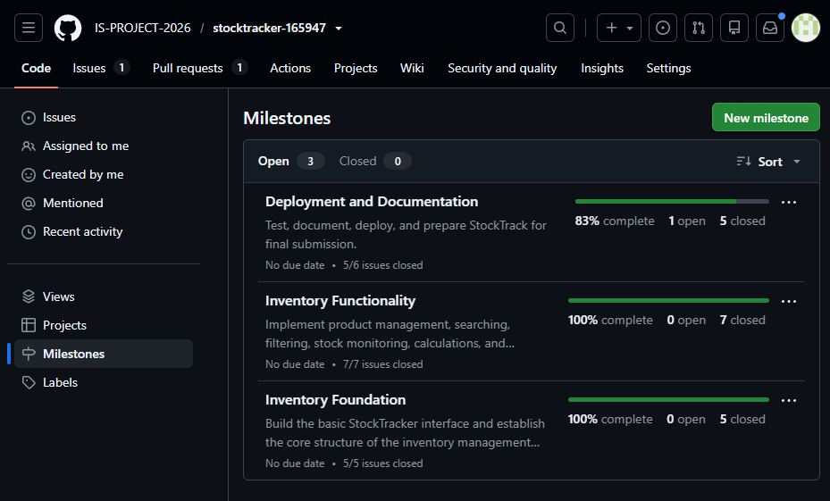]

* **Caption:** [The project was divided into three development milestones, with each milestone containing granular issues used to plan and track the implementation work.]

### B. Project Board
*Provide a screenshot of your GitHub Project Board with your issues organized dynamically across columns (To Do, In Progress, Done).*

[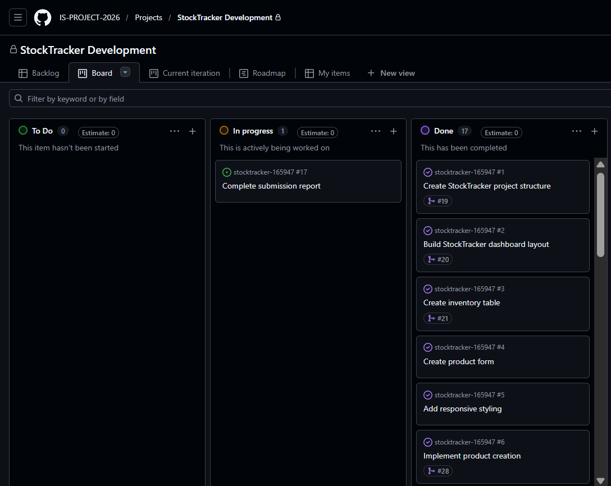]

* **Caption:** [The Project board was used to track development tasks as they progressed from To Do through In Progress to Done.]

### C. Branching Architecture
*Provide a screenshot showing your local or remote Git branch list, highlighting your use of conventional, issue-linked naming patterns (e.g., `feat/`, `fix/`, `style/`).*

[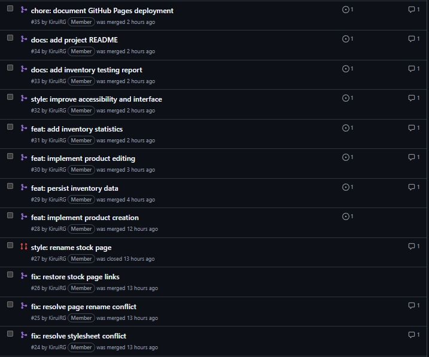]

* **Caption:** [Development was isolated into issue-linked feature, fix, and style branches rather than committing development work directly to main.]

### D. Pull Requests & Traceability
*Provide a screenshot of a completed or open Pull Request (PR) on GitHub that clearly shows it is linked to a related development issue.*

[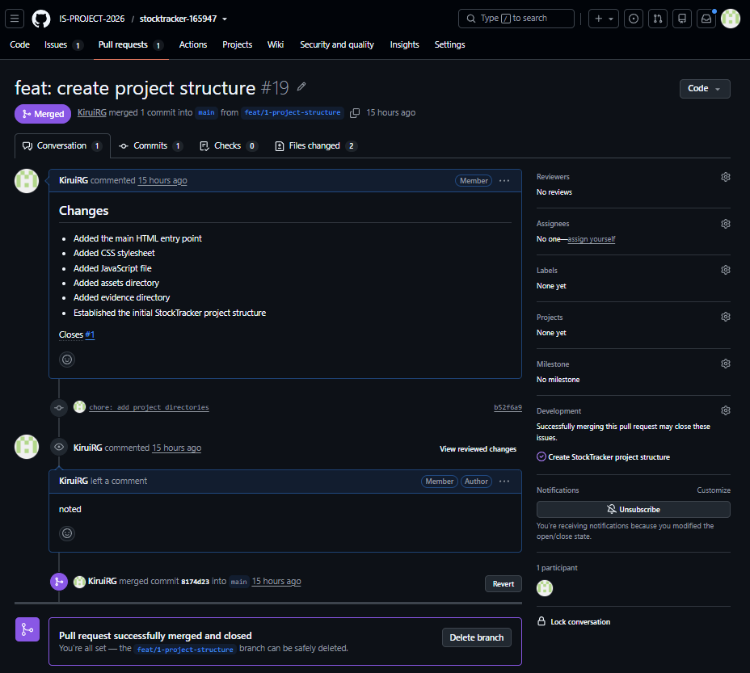]

* **Caption:** [PR #21 adds the core inventory management functionality, including product creation, deletion, search, filtering, stock status calculation, and dashboard integration, and closes Issue #3.]

---

## 5. Merge Conflict Evidence

You must engineer **three merge conflicts**, each triggered by a **different cause** from those covered in the lecture. For Conflict 1, document the full resolution lifecycle. For Conflicts 2 and 3, provide the conflict marker screenshot and identify the cause.

> **Marks:** Conflict 1 full chronology (2 marks) · Conflict 2 (1 mark) · Conflict 3 (1 mark) · All three use distinct causes (1 mark) = **5 marks total**

---

### Conflict 1 — Full Chronology

**What cause did you use?** [Same-line/content conflict: two branches modified the same section of the inventory page, causing Git to require a manual decision when the branches were merged.]

#### Step 1: Generating the Clash
*Screenshot showing the merge attempt and the conflict warning.*

[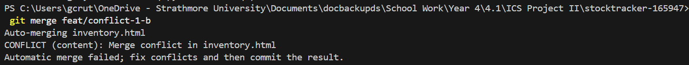]

* **Caption:** [The feat/conflict-1-a and feat/conflict-1-b branches contained different changes to the inventory heading. When the branches were merged, Git detected conflicting changes and reported a merge conflict.]

#### Step 2: Inside the Code Editor (Conflict Markers)
*Screenshot showing the raw, unresolved conflict markers (`<<<<<<< HEAD`, `=======`, `>>>>>>>`) in your editor.*

[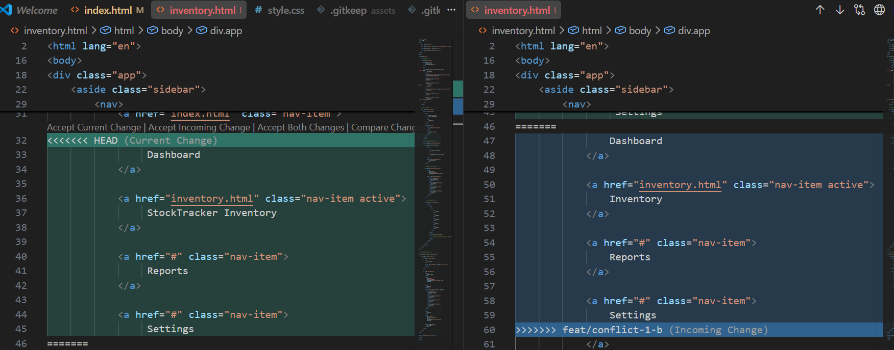]

* **Caption:** [Git marked the two competing versions of the inventory heading with conflict markers. I reviewed both versions and selected the appropriate heading before removing the conflict markers.]

#### Step 3: Resolution & Clean Merge
*Screenshot of your clean Git history or completed PR showing the conflict was resolved and merged.*

[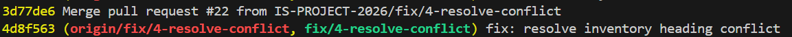]

* **Caption:** [The conflicting heading was resolved and committed on fix/4-resolve-conflict. The resolved branch was then merged into main through a pull request.]

---

### Conflict 2 — Different Cause

**What cause did you use?** [Conflicting changes to the same stylesheet/code section.]

**Why does this cause trigger a conflict?** [The two branches modified the same section of the stylesheet differently. Because Git could not automatically combine the competing changes, it inserted conflict markers and required manual resolution.]

[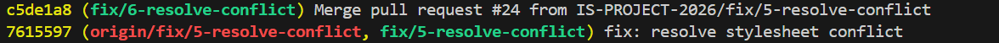]
[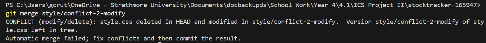]

* **Caption:** [The two branches introduced different changes to the stylesheet, causing Git to mark the overlapping changes as a conflict. The conflict was manually resolved before the resulting branch was merged.]

---

### Conflict 3 — Different Cause

**What cause did you use?** [File rename conflict.]

**Why does this cause trigger a conflict?** [The branches made incompatible changes involving the name/location of the inventory page. Git could not automatically reconcile the competing rename operations, so the changes required manual resolution.]

[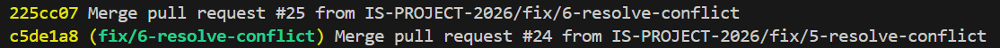]
[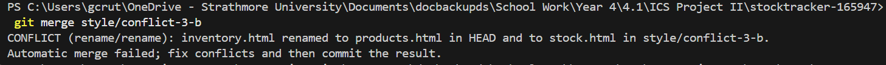]

* **Caption:** [The conflicting branches attempted to rename the inventory page differently. Git could not automatically determine the intended final filename, requiring the rename to be resolved manually.]

---
##
## 6. Feedback & Evaluation

To help improve this course for future engineering cohorts, please take 2 minutes to fill out the anonymous feedback form. Your honest review helps shape how this program is taught next semester!
- [ ] **Anonymous Evaluation Form:** [Course & Instructor Evaluation](https://forms.gle/YLybnsyXXErKEg3s9)

---
 
## Final Submission
 
Once your repository is complete, submit your work through the official submission form below. The form will **stop accepting responses after Monday, August 17th, 2026** — no late submissions will be accepted.
 
> **Submission Form:** [https://forms.gle/KrT4VxtFtkU3wtYu8](https://forms.gle/KrT4VxtFtkU3wtYu8)
